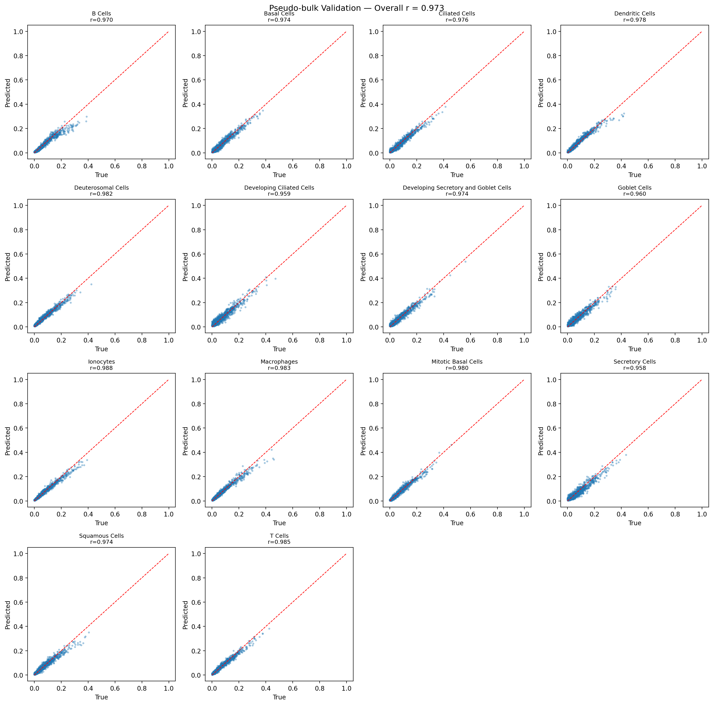
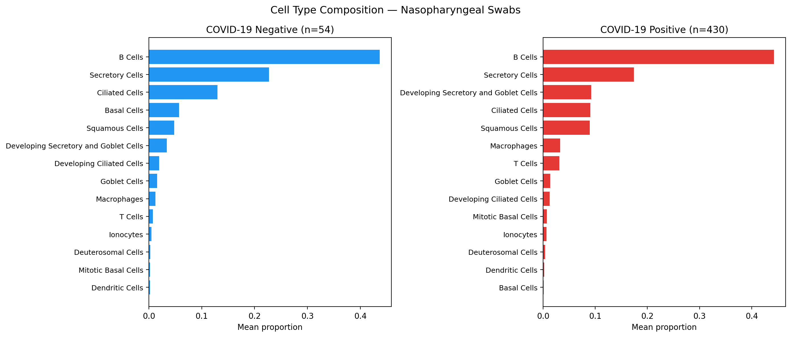
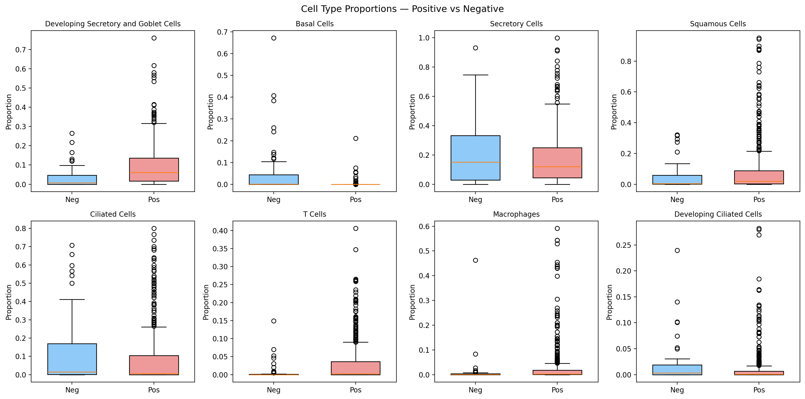

# COVID-19 Airway Cell Type Deconvolution

[](LICENSE)
[](https://www.python.org/)

Which cell types in the nasopharyngeal airway drive the host transcriptional response to SARS-CoV-2?

Bulk RNA-seq averages expression across all cells in a sample — it detects 1,773 differentially expressed genes during COVID infection ([bulk-rnaseq-differential-expression](https://github.com/Ekin-Kahraman/bulk-rnaseq-differential-expression)) but cannot tell you whether those genes are activated in ciliated epithelial cells, infiltrating immune cells, or goblet cells expanding in response to damage.

This project trains a PyTorch neural network on tissue-matched nasopharyngeal single-cell data to decompose 484 bulk COVID samples into their cellular components — something [nobody has done for this dataset](https://pubmed.ncbi.nlm.nih.gov/?term=GSE152075+deconvolution).

## Results

**Validation Pearson r = 0.973** on held-out pseudo-bulk samples. 14 cell types deconvolved across 484 patients.



### What changes during COVID-19 infection

| Depleted in COVID+ | Expanded in COVID+ |
|---|---|
| Basal cells (-5.6%) — epithelial stem cells damaged | Developing secretory/goblet (+5.8%) — goblet cell hyperplasia |
| Secretory cells (-5.3%) — secretory epithelium lost | Squamous cells (+4.2%) — squamous metaplasia |
| Ciliated cells (-3.9%) — SARS-CoV-2 targets ACE2+ ciliated epithelium | T cells (+2.3%) — immune infiltration |
| | Macrophages (+2.0%) — inflammatory recruitment |





### Biological interpretation

The ciliated cell depletion is the central finding. SARS-CoV-2 enters airway cells via ACE2, which is highly expressed on ciliated epithelium. Viral replication kills ciliated cells, impairing mucociliary clearance — the airway's primary defence against pathogens. The compensatory expansion of goblet cells (mucus-producing) and squamous metaplasia (stress-induced tissue remodelling) are well-documented responses to epithelial damage in COVID-19 (Ziegler et al. 2021, Chua et al. 2020).

The immune infiltration (T cells +2.3%, macrophages +2.0%) is consistent with the interferon-stimulated gene signature identified in the [DE analysis](https://github.com/Ekin-Kahraman/bulk-rnaseq-differential-expression). The ISGs detected by DESeq2 are likely produced by these infiltrating immune cells — connecting the bulk DE findings to their cellular source.

The original Lieberman et al. (2020) analysis used CIBERSORTx with a blood-derived immune reference (LM22) to estimate immune cell proportions only. This project uses a tissue-matched nasopharyngeal scRNA-seq reference to deconvolve both epithelial AND immune cell types — revealing the epithelial damage that the original analysis could not detect.

## Data

| Dataset | Source | Description |
|---|---|---|
| **Bulk RNA-seq** | [GSE152075](https://www.ncbi.nlm.nih.gov/geo/query/acc.cgi?acc=GSE152075) (Lieberman et al. 2020) | 484 nasopharyngeal swabs (430 COVID+, 54 negative) |
| **scRNA-seq reference** | [Ziegler et al. 2021](https://doi.org/10.1016/j.cell.2021.07.023), *Cell* | 32,588 nasopharyngeal cells from 58 participants, tissue-matched |

## Method

1. **Load reference**: Ziegler et al. nasopharyngeal scRNA-seq with 14 cell type annotations (3 rare types + erythroblast blood contamination excluded)
2. **Shared gene space**: 19,759 shared genes between reference and bulk → 2,000 HVGs
3. **Pseudo-bulk generation**: 5,000 synthetic bulk samples created by mixing single cells in random Dirichlet-sampled proportions (500 cells per sample)
4. **Neural network**: 2-layer feedforward network (2000 → 256 → 128 → 14) with batch normalisation, dropout, and softmax output. Trained with KL divergence loss.
5. **Validation**: 80/20 train/val split on pseudo-bulk. Pearson r = 0.973 overall, all cell types r > 0.95.
6. **Application**: Deconvolve all 484 GSE152075 bulk samples. Compare cell type proportions between COVID+ and negative.

## Design Decisions

- **PyTorch over BayesPrism/MuSiC** — builds ML skills while producing comparable results. BayesPrism would be the standard choice; using a neural network demonstrates both the biology and the ML.
- **Dirichlet pseudo-bulk sampling** — generates diverse composition mixtures spanning the full simplex, not just mixtures near the reference proportions. This forces the model to generalise.
- **Rare type exclusion (<50 cells)** — Mast cells (9), Plasmacytoid DCs (13), and Enteroendocrine cells (41) excluded because pseudo-bulk training just recycles the same few cells, producing unreliable signatures.
- **Erythroblast exclusion** — blood contamination from nasal swab collection, not an airway cell type. Including them causes the model to assign 70%+ erythroblast fractions to bulk samples.
- **KL divergence loss** — appropriate for probability distributions (cell type proportions lie on a simplex). MSE loss does not respect the compositional constraint.
- **Simple architecture** — with 5,000 training samples and 2,000 features, deeper networks overfit. Two hidden layers with dropout is the right complexity.

## Quick Start

```bash
git clone https://github.com/Ekin-Kahraman/covid-airway-deconvolution.git
cd covid-airway-deconvolution
pip install -r requirements.txt

# Download scRNA-seq reference (~672MB, one time)
mkdir -p data
wget -O data/ziegler2021_nasopharyngeal.h5ad \
  "https://covid19.cog.sanger.ac.uk/submissions/release2/20210217_NasalSwab_Broad_BCH_UMMC_to_CZI.h5ad"

# Run (downloads bulk data automatically, ~10 minutes total)
python deconvolve.py
```

## Output

```
results/
├── cell_type_proportions.csv           Per-sample proportions (484 × 14)
├── mean_proportions_by_condition.csv   COVID+ vs negative comparison
├── deconvolution_model.pt              Trained PyTorch model
└── figures/
    ├── validation_scatter.png          Predicted vs true (pseudo-bulk)
    ├── training_loss.png               Training curves
    ├── composition_by_condition.png    Mean cell type bar charts
    └── boxplots_by_condition.png       Top changing cell types
```

## Limitations

- **Pseudo-bulk training, not real matched samples.** The model is trained on synthetic mixtures, not real bulk samples with known cell type proportions. Validation on real paired bulk + scRNA-seq data would strengthen the results.
- **B cell proportion is high (~44%).** Nasopharyngeal swabs sample lymphoid tissue (Waldeyer's ring) adjacent to the airway epithelium, which inflates B cell representation. This is a biological property of the sampling site, not a model error.
- **Single reference dataset.** Ziegler et al. represents one lab, one protocol, one set of patients. A multi-study reference (combining Chua et al., Qi et al.) would improve robustness.
- **No external validation.** The model has not been tested on an independent bulk NP dataset. Ng et al. (GSE163151) could serve as external validation.
- **Erythroblasts excluded.** Their presence in the reference (3%) is blood contamination. Excluding them is the correct biological decision but it means the model cannot detect true erythroid infiltration if it occurs.

## References

- Lieberman NAP et al. (2020) *In vivo antiviral host transcriptional response to SARS-CoV-2 by viral load, sex, and age.* PLOS Biology. [DOI: 10.1371/journal.pbio.3000849](https://doi.org/10.1371/journal.pbio.3000849)
- Ziegler CGK et al. (2021) *Impaired local intrinsic immunity to SARS-CoV-2 infection in severe COVID-19.* Cell. [DOI: 10.1016/j.cell.2021.07.023](https://doi.org/10.1016/j.cell.2021.07.023)
- Chua RL et al. (2020) *COVID-19 severity correlates with airway epithelium-immune cell interactions.* Nature Biotechnology. [DOI: 10.1038/s41587-020-0602-4](https://doi.org/10.1038/s41587-020-0602-4)

## Licence

MIT
