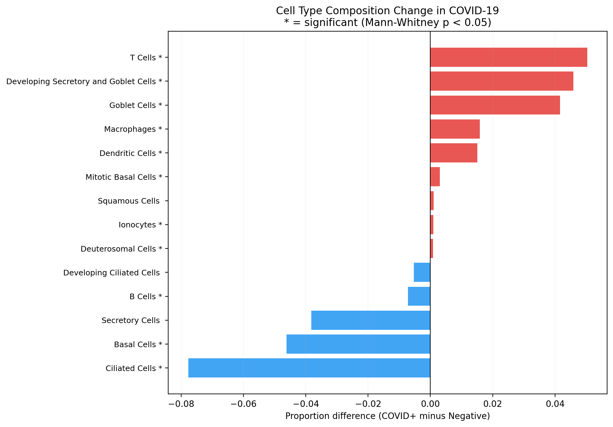

# COVID-19 Airway Cell Type Deconvolution

[](https://github.com/Ekin-Kahraman/covid-airway-deconvolution/actions/workflows/ci.yml)
[](LICENSE)
[](https://www.python.org/)

Which cell types in the nasopharyngeal airway drive the host transcriptional response to SARS-CoV-2?

Bulk RNA-seq averages expression across all cells in a sample — it detects 1,773 differentially expressed genes during COVID infection ([bulk-rnaseq-differential-expression](https://github.com/Ekin-Kahraman/bulk-rnaseq-differential-expression)) but cannot tell you whether those genes are activated in ciliated epithelial cells, infiltrating immune cells, or goblet cells expanding in response to damage.

This project trains a PyTorch neural network on tissue-matched nasopharyngeal single-cell data to decompose 484 bulk COVID samples into their cellular components — something [nobody has done for this dataset](https://pubmed.ncbi.nlm.nih.gov/?term=GSE152075+deconvolution).

## Results

**5-fold CV Pearson r = 0.954 +/- 0.001, RMSE = 0.032** on noisy pseudo-bulk. This is an upper bound — pseudo-bulk validation systematically overestimates real-bulk performance because it does not capture batch effects or library preparation artefacts ([BAL benchmark, 2026](https://www.biorxiv.org/content/10.64898/2026.01.14.699304v1.full)). 14 cell types deconvolved across 484 patients. 10 show statistically significant composition changes between COVID+ and negative (Mann-Whitney U, p < 0.05).

Per-cell-type validation (held-out pseudo-bulk): Squamous r=0.978, Ciliated r=0.977, T Cells r=0.975, Macrophages r=0.974, Basal r=0.972, Goblet r=0.967, Secretory r=0.965, Ionocytes r=0.961, Developing Ciliated r=0.957, Deuterosomal r=0.956, Dendritic r=0.955, Mitotic Basal r=0.943, Developing Secretory/Goblet r=0.937, B Cells r=0.936.


### What changes during COVID-19 infection

**Expanded in COVID+ (tissue damage response + immune infiltration):**

| Cell Type | Change | p-value | Interpretation |
|---|---|---|---|
| Goblet cells | +5.4% | 2.0e-04 | Goblet cell hyperplasia — mucus overproduction compensating for lost mucociliary clearance |
| T cells | +5.1% | 1.5e-06 | Adaptive immune cells infiltrating the nasal epithelium in response to viral antigen |
| Macrophages | +1.8% | 4.9e-07 | Inflammatory monocyte-derived macrophages recruited to the infection site |
| Developing secretory/goblet | +1.3% | 1.1e-06 | Progenitor cells differentiating toward the goblet lineage — active tissue remodelling |
| Dendritic cells | +0.8% | 2.3e-08 | Professional antigen-presenting cells bridging innate and adaptive immunity |
| Squamous cells | +0.8% | 1.1e-03 | Squamous metaplasia — damaged pseudostratified epithelium replaced by stress-resistant squamous cells |
| Ionocytes | +0.2% | 4.7e-02 | Rare chemosensory cells — modest expansion may reflect mucosal irritation signalling |
| Mitotic basal cells | +0.1% | 2.8e-02 | Proliferating basal cells — residual stem cells entering cell cycle to compensate for epithelial loss |

**Depleted in COVID+ (epithelial damage):**

| Cell Type | Change | p-value | Interpretation |
|---|---|---|---|
| Basal cells | -5.1% | 3.6e-04 | Epithelial stem cell depletion — the regenerative layer is damaged, impairing tissue repair |
| Developing ciliated | -0.4% | 9.8e-03 | Fewer progenitors differentiating toward ciliated fate — consistent with basal cell loss upstream |

**Not significantly changed:** Ciliated cells (-2.1%, p=0.64), Secretory cells (-7.0%, p=0.09), B cells (-0.8%, p=0.27), Deuterosomal cells (+0.05%, p=0.10). The absence of significant ciliated cell depletion despite known ACE2-mediated viral entry may reflect the limitations of the pseudo-bulk training approach, or that ciliated cell loss is heterogeneous across patients and does not reach significance with n=54 negative controls.



<details>
<summary>Additional figures</summary>


</details>

### Biological interpretation

The dominant pattern is **epithelial remodelling with immune infiltration**. Basal cells (the epithelial stem cells) are depleted, and the progenitor cells that normally differentiate into ciliated epithelium (developing ciliated cells) are also reduced. The tissue compensates by expanding goblet cells and developing secretory/goblet progenitors — shifting the epithelium from a ciliated, mucociliary-clearing phenotype toward a mucus-secreting phenotype. This is consistent with the mucus hypersecretion and impaired clearance observed clinically in COVID-19 patients.

The squamous metaplasia (+0.8%) reflects chronic epithelial stress — pseudostratified columnar epithelium being replaced by squamous cells that are more resistant to damage but less functional.

The immune infiltration — T cells (+5.1%), macrophages (+1.8%), dendritic cells (+0.8%) — represents the cellular source of the interferon-stimulated gene signature identified in the [DESeq2 analysis](https://github.com/Ekin-Kahraman/bulk-rnaseq-differential-expression). The 1,773 DE genes (dominated by IFIT1, CXCL10, OAS3) are produced by these infiltrating immune cells, not by the epithelium itself. This connects the bulk transcriptomic findings to their cellular origin.

The original Lieberman et al. (2020) analysis used CIBERSORTx with a blood-derived immune reference (LM22) — a poor match for nasopharyngeal tissue. They estimated immune cell proportions only and could not detect epithelial changes. This project uses a tissue-matched scRNA-seq reference from nasopharyngeal swabs (Ziegler et al. 2021) to deconvolve both epithelial and immune compartments, revealing the epithelial remodelling that the original analysis missed.

### Viral load correlation

Among 413 COVID+ samples with Ct values, higher viral load (lower Ct) correlates with secretory cell loss (r = -0.160, p = 0.001) — more virus means more epithelial destruction. Ionocytes show the opposite pattern (r = +0.136, p = 0.006), potentially reflecting chemosensory expansion in response to mucosal damage.

### Sex differences

Male COVID+ patients show 1.97% higher macrophage infiltration than females (p = 0.004). This connects to the [12 sex-biased DE genes](https://github.com/Ekin-Kahraman/bulk-rnaseq-differential-expression) found in the bulk analysis — the deconvolution identifies macrophages as a cellular source of sex-differential immune activation. Males have worse COVID outcomes in the literature; greater macrophage infiltration may contribute to the more aggressive inflammatory response observed in male patients.

## Data

| Dataset | Source | Description |
|---|---|---|
| Bulk RNA-seq | [GSE152075](https://www.ncbi.nlm.nih.gov/geo/query/acc.cgi?acc=GSE152075) (Lieberman et al. 2020) | 484 nasopharyngeal swabs (430 COVID+, 54 negative) |
| scRNA-seq reference | [Ziegler et al. 2021](https://doi.org/10.1016/j.cell.2021.07.023), *Cell* | 32,588 nasopharyngeal cells from 58 participants |

## Method

1. **Load reference**: Ziegler et al. nasopharyngeal scRNA-seq. 14 cell types retained after excluding 3 rare types (<50 cells: Mast cells, Plasmacytoid DCs, Enteroendocrine cells) and erythroblasts (blood contamination).
2. **Shared gene space**: 19,759 genes shared between reference and bulk → 2,000 HVGs selected on the reference.
3. **Pseudo-bulk generation**: 10,000 synthetic bulk samples created by mixing single cells in Dirichlet-sampled proportions weighted by reference prevalence (500 cells per sample).
4. **Noise augmentation**: Gene dropout (2-8%), library size variation (log-normal), Gaussian noise applied to pseudo-bulk to simulate real bulk technical artefacts.
5. **Ensemble neural network**: Three feedforward sub-networks (hidden dims 128, 256, 512) with averaged predictions — following the Scaden ensemble strategy (Menden et al. 2020). Each sub-network: BatchNorm, ReLU, Dropout, softmax output. Trained with KL divergence loss, Adam optimiser.
6. **5-fold cross-validation**: r = 0.954 +/- 0.001 across folds — stable, no fold-dependent variance.
7. **Baseline comparison**: Non-negative least squares (NNLS) r = 0.609 on the same data. Ensemble NN outperforms the linear baseline by 57%.
6. **Early stopping**: Patience = 20 epochs. Training stopped at epoch 109.
8. **Validation**: 5-fold CV (r = 0.954 +/- 0.001) + final 80/20 split (r = 0.954, RMSE = 0.031).
8. **Application**: Deconvolve all 484 GSE152075 bulk samples. Mann-Whitney U test for composition differences between COVID+ and negative.

## Design Decisions

- **Ensemble of 3 networks over a single DNN** — averaging predictions from sub-networks with different capacities (128/256/512 hidden dim) reduces variance without increasing bias. Same strategy as Scaden (Menden et al. 2020, Science Advances). 5-fold CV variance is +/- 0.001, confirming stability.
- **PyTorch over BayesPrism/MuSiC** — the standard choice for this problem would be BayesPrism or MuSiC. Using a neural network demonstrates both the biological question and the ML methodology.
- **Dirichlet sampling weighted by reference prevalence** — uniform Dirichlet (alpha=1) gives equal weight to all cell types, which overrepresents rare types in training. Weighting alpha by reference composition generates realistic mixtures where common types (ciliated, 31.9%) dominate and rare types (DCs, 0.5%) appear infrequently.
- **Noise augmentation** — pseudo-bulk is artificially clean. Real bulk RNA-seq has gene dropout from low-abundance transcripts, library size variation from sequencing depth differences, and technical noise from library preparation. Adding these during training forces the model to learn robust signatures rather than memorising clean patterns.
- **Rare type exclusion (<50 cells)** — Mast cells (9), Plasmacytoid DCs (13), and Enteroendocrine cells (41) excluded because with fewer than 50 reference cells, pseudo-bulk training recycles the same profiles, producing overfitted and unreliable signatures.
- **Erythroblast exclusion** — 986 erythroblasts in the reference are blood contamination from nasal swab collection, not airway-resident cells. Including them causes the model to assign 70%+ erythroblast fractions to bulk samples because their transcriptomic signature is distinct from all airway cell types, and the model uses them as a catch-all.
- **KL divergence loss** — cell type proportions lie on a simplex (non-negative, sum to 1). KL divergence is the natural loss function for comparing probability distributions. MSE treats each proportion independently and does not respect the compositional constraint.
- **Softmax output clamped before log** — prevents numerical instability when any predicted proportion approaches zero.

## Quick Start

```bash
git clone https://github.com/Ekin-Kahraman/covid-airway-deconvolution.git
cd covid-airway-deconvolution
pip install -r requirements.txt

# Download scRNA-seq reference (~672MB, one time)
mkdir -p data
wget -O data/ziegler2021_nasopharyngeal.h5ad \
  "https://covid19.cog.sanger.ac.uk/submissions/release2/20210217_NasalSwab_Broad_BCH_UMMC_to_CZI.h5ad"

# Run (downloads bulk data automatically, ~10 minutes total)
python deconvolve.py
```

## Output

```
results/
├── cell_type_proportions.csv           Per-sample proportions (484 × 14)
├── mean_proportions_by_condition.csv   Condition comparison with p-values
├── deconvolution_model.pt              Trained PyTorch model weights
└── figures/
    ├── validation_scatter.png          Predicted vs true per cell type
    ├── training_loss.png               Training and validation loss curves
    ├── composition_difference.png      Proportion change with significance
    ├── composition_by_condition.png    Grouped bar chart by condition
    └── boxplots_by_condition.png       Top changing cell types
```

## Limitations

- **Pseudo-bulk training, not real matched samples.** The model is trained on synthetic mixtures, not on real bulk samples with experimentally determined cell type proportions. Validation on paired bulk + scRNA-seq from the same patients would be the gold standard.
- **B cell proportion is high (~40%).** Nasopharyngeal swabs sample the Waldeyer's tonsillar ring — lymphoid tissue adjacent to the airway epithelium — which inflates B cell representation. This is a biological property of the sampling site, not a model error.
- **Single reference dataset.** Ziegler et al. represents one lab, one sequencing protocol, one patient cohort. A multi-study reference (combining Chua et al., Qi et al., Ng et al.) would improve robustness and reduce lab-specific biases.
- **No external validation.** The model has not been tested on an independent bulk nasopharyngeal dataset. Ng et al. (GSE163151, n=286) would be a natural validation cohort.
- **Class imbalance in the bulk data.** 430 COVID+ vs 54 negative. The statistical tests account for this, but the negative group is small.
- **Erythroblasts excluded.** Correct for this tissue (blood contamination), but prevents detection of genuine erythroid infiltration if it occurs in pathological conditions.

## References

- Lieberman NAP et al. (2020) *In vivo antiviral host transcriptional response to SARS-CoV-2 by viral load, sex, and age.* PLOS Biology. [DOI: 10.1371/journal.pbio.3000849](https://doi.org/10.1371/journal.pbio.3000849)
- Ziegler CGK et al. (2021) *Impaired local intrinsic immunity to SARS-CoV-2 infection in severe COVID-19.* Cell. [DOI: 10.1016/j.cell.2021.07.023](https://doi.org/10.1016/j.cell.2021.07.023)
- Chua RL et al. (2020) *COVID-19 severity correlates with airway epithelium-immune cell interactions.* Nature Biotechnology. [DOI: 10.1038/s41587-020-0602-4](https://doi.org/10.1038/s41587-020-0602-4)

## Licence

MIT
