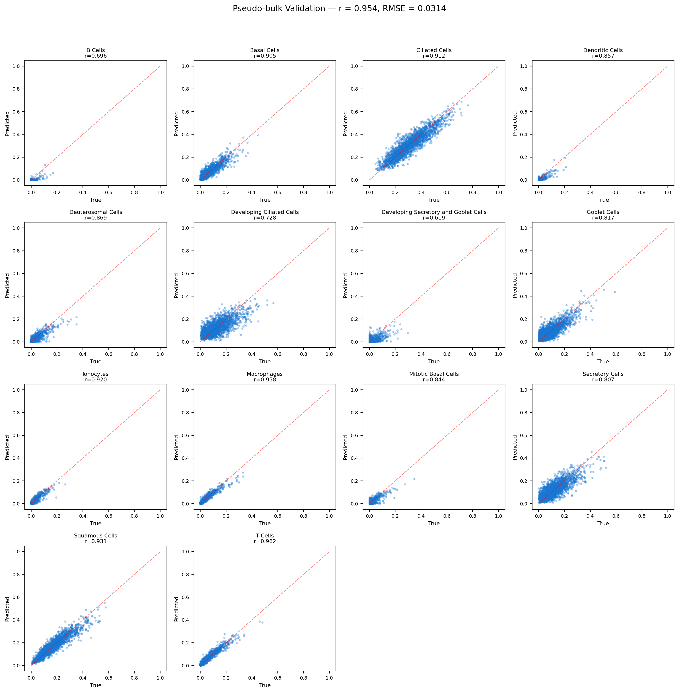
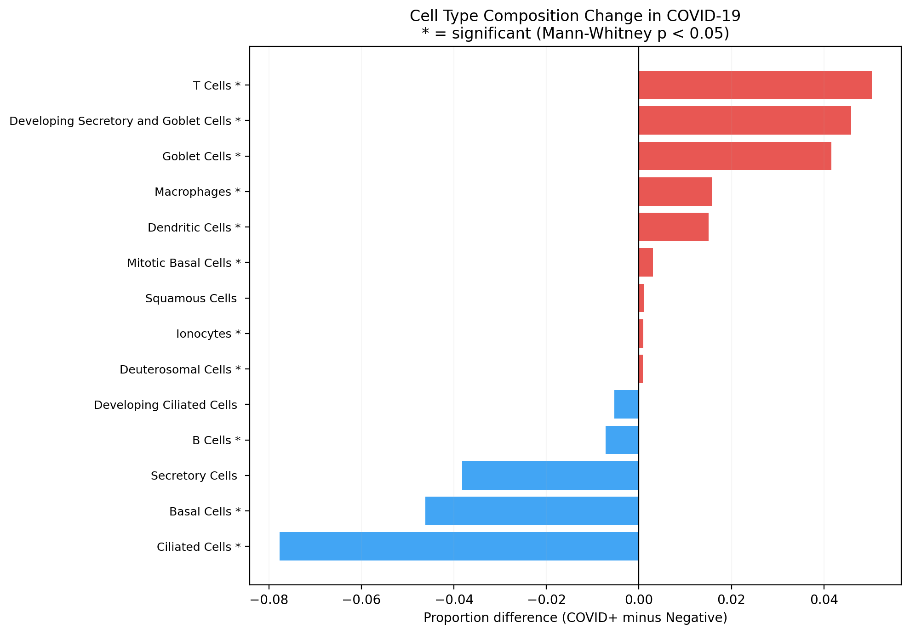
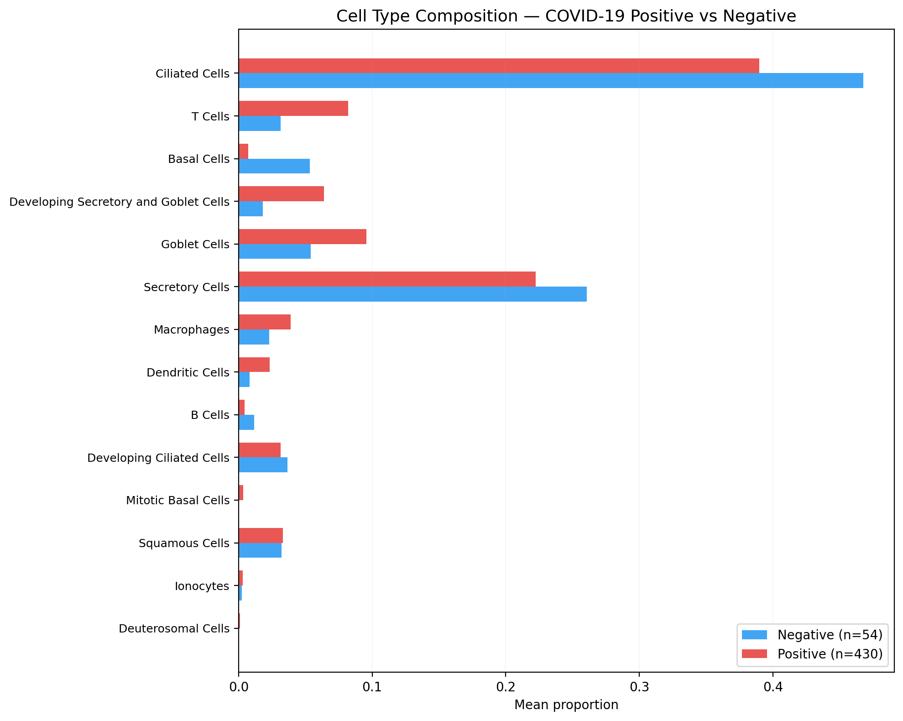
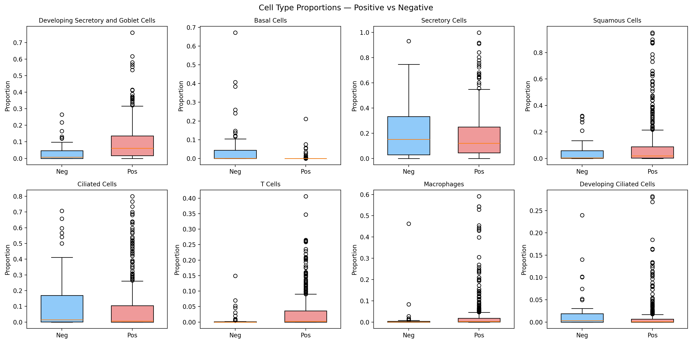

# Estimating airway cell-type proportions in COVID-19

[](https://github.com/Ekin-Kahraman/covid-airway-deconvolution/actions/workflows/ci.yml)
[](LICENSE)
[](https://www.python.org/)

How does the estimated balance of epithelial and immune cells differ between
COVID-positive and negative nasal-swab samples?

This project uses a single-cell airway reference to estimate the proportions
of **14 cell types in 484 bulk RNA-seq samples**. This approach, called
deconvolution, complements the [gene-expression analysis](https://github.com/Ekin-Kahraman/bulk-rnaseq-differential-expression).
The proportions are model estimates, not direct cell counts.

## Validation and reproducibility

- Validation on simulated cell mixtures gives a cross-validation correlation of **0.954**; this is not measured accuracy on the 484 real samples.
- In an external cohort, 8 of 14 estimated changes agree in direction, but effect-size correlation is only **0.057**. Generalisation remains limited.
- Saved model metadata records the input genes, cell types, settings and validation results needed for reuse.
- Automated tests cover mixture generation, valid proportions, statistical summaries and figures. Group comparisons include multiple-testing correction.

See [`docs/VALIDATION.md`](docs/VALIDATION.md) for the tests, baseline comparison and limitations.

## Results

**Five-fold cross-validation: Pearson r = 0.954 +/- 0.001, RMSE = 0.032** on
noisy simulated mixtures (pseudo-bulk). These tests may be optimistic because
simulation cannot reproduce every difference between real samples and the
reference. On the model-estimated proportions, 10 of 14 cell types meet q < 0.05
in COVID-positive versus negative comparisons; this does not validate the
proportions against experimental cell counts.

Per-cell-type correlations on held-out simulated mixtures range from 0.936 to
0.978. The figure below shows predicted versus known proportions in that test.



### Estimated differences by COVID-19 status

**Higher estimated proportions in COVID-positive samples:**

Changes below are absolute percentage points, not relative percentage changes.
The interpretation column describes hypotheses, not directly observed mechanisms.

| Cell Type | Change (percentage points) | p-value | q-value | Interpretation |
|---|---:|---:|---:|---|
| T cells | +5.0 | 7.8e-07 | 2.7e-06 | Higher estimated T-cell representation |
| Developing secretory/goblet | +4.6 | 5.1e-12 | 7.1e-11 | Higher estimated secretory/goblet-lineage representation |
| Goblet cells | +4.2 | 1.5e-03 | 3.0e-03 | Possible change in mucus-associated cell composition |
| Macrophages | +1.6 | 4.4e-07 | 2.1e-06 | Higher estimated macrophage representation |
| Dendritic cells | +1.5 | 3.7e-08 | 2.6e-07 | Higher estimated antigen-presenting-cell representation |
| Mitotic basal cells | +0.3 | 3.6e-04 | 8.4e-04 | Possible change in proliferating basal-cell representation |
| Ionocytes | +0.1 | 3.2e-02 | 4.5e-02 | Small estimated change in a rare cell type |

**Lower estimated proportions in COVID-positive samples:**

| Cell Type | Change (percentage points) | p-value | q-value | Interpretation |
|---|---:|---:|---:|---|
| Ciliated cells | -7.8 | 1.4e-02 | 2.2e-02 | Lower estimated ciliated-cell representation |
| Basal cells | -4.6 | 3.2e-06 | 9.0e-06 | Lower estimated basal-cell representation |
| B cells | -0.7 | 9.6e-03 | 1.7e-02 | Small but significant decrease in the deconvolved bulk proportions |

**Not FDR-significant:** Deuterosomal cells (+0.1%, p=0.049, q=0.062), Squamous cells (+0.1%, p=0.136, q=0.159), Developing ciliated cells (-0.5%, p=0.533, q=0.533), Secretory cells (-3.8%, p=0.323, q=0.348). These non-significant calls are kept explicit because pseudo-bulk deconvolution can be sensitive to the reference cohort and to the negative-control sample size (n=54).



<details>
<summary>Additional figures</summary>





</details>

### Biological interpretation

The estimates suggest differences in epithelial and immune-cell composition:
lower ciliated/basal-cell proportions and higher T-cell, macrophage and
secretory/goblet-lineage proportions. Direct measurements would be needed to
confirm cell loss, infiltration, tissue damage or altered mucus production.

Squamous cells trend slightly upward but are not significant in this run, so the data do not support a strong squamous-metaplasia claim.

These estimated composition differences provide hypotheses for interpreting the
interferon-associated signature in the [DESeq2 analysis](https://github.com/Ekin-Kahraman/bulk-rnaseq-differential-expression).
They do not identify which cells produced each expression change.

The airway reference includes both epithelial and immune cells, allowing a
broader set of candidate cell types than an immune-only reference. This is a
choice of biological scope, not a demonstrated accuracy advantage over CIBERSORTx
or other established methods.

### Viral load correlation

Among 413 COVID+ samples with Ct values, secretory-cell proportion is negatively correlated with N1 Ct (r = -0.160, p = 0.001), while ionocytes are positively correlated with N1 Ct (r = +0.136, p = 0.006). Because lower Ct means higher viral load, these are Ct correlations rather than direct mechanistic proof of viral-load-driven cell loss.

### Sex differences

The exploratory comparison reports a 1.97-percentage-point higher estimated
macrophage proportion in male COVID-positive samples (p = 0.004). It does not
establish macrophage infiltration, the cellular source of sex-associated gene
expression, or differences in clinical risk.

## Data

| Dataset | Source | Description |
|---|---|---|
| Bulk RNA-seq | [GSE152075](https://www.ncbi.nlm.nih.gov/geo/query/acc.cgi?acc=GSE152075) (Lieberman et al. 2020) | 484 nasopharyngeal swabs (430 COVID+, 54 negative) |
| scRNA-seq reference | [Ziegler et al. 2021](https://doi.org/10.1016/j.cell.2021.07.023), *Cell* | 32,588 nasopharyngeal cells from 58 participants |

## Method

1. **Load reference**: Ziegler et al. nasopharyngeal scRNA-seq. 14 cell types retained after excluding 3 rare types (<50 cells: Mast cells, Plasmacytoid DCs, Enteroendocrine cells) and erythroblasts (blood contamination).
2. **Shared gene space**: 19,759 genes shared between reference and bulk → 2,000 HVGs selected on the reference.
3. **Pseudo-bulk generation**: 10,000 synthetic bulk samples created by mixing single cells in Dirichlet-sampled proportions weighted by reference prevalence (500 cells per sample).
4. **Noise augmentation**: Gene dropout (2-8%), library size variation (log-normal), Gaussian noise applied to pseudo-bulk to simulate real bulk technical artefacts.
5. **Ensemble neural network**: Three feedforward sub-networks (hidden dims 128, 256, 512) with averaged predictions - following the Scaden ensemble strategy (Menden et al. 2020). Each sub-network: BatchNorm, ReLU, Dropout, softmax output. Trained with KL divergence loss, Adam optimiser (lr=1e-3, weight_decay=1e-5), ReduceLROnPlateau scheduler (patience=10, factor=0.5).
6. **Early stopping**: Patience = 20 epochs. Training stopped at epoch 109.
7. **5-fold cross-validation**: r = 0.954 +/- 0.001 across simulated-mixture folds; low observed variation, not independent-donor validation.
8. **Baseline comparison**: Non-negative least squares (NNLS) r = 0.609 on the same data. The neural model has higher correlation on this simulated-mixture test; a percentage increase in correlation is not a percentage gain in accuracy.
9. **Validation**: Final 80/20 split (r = 0.954, RMSE = 0.031).
10. **Application**: Deconvolve all 484 GSE152075 bulk samples. Mann-Whitney U test for composition differences between COVID+ and negative.

## Design Decisions

- **Three-network ensemble** - average models with different capacities, following Scaden's approach, to reduce sensitivity to one architecture. The observed fold variation is small; this does not guarantee lower bias or better external performance.
- **PyTorch implementation** - supports the neural mixture model and custom training experiments. Comparisons with BayesPrism, MuSiC and other established methods remain future work.
- **Dirichlet sampling weighted by reference prevalence** - uniform Dirichlet (alpha=1) gives equal weight to all cell types, which overrepresents rare types in training. Weighting by reference composition makes common reference cell types more frequent in training mixtures. This is an assumption about plausible mixtures, not validation of real sample composition.
- **Noise augmentation** - pseudo-bulk is artificially clean. Real bulk RNA-seq has gene dropout from low-abundance transcripts, library size variation from sequencing depth differences, and technical noise from library preparation. Adding noise tests a wider range of inputs, but cannot guarantee robustness to real technical or biological differences.
- **Rare type exclusion (<50 cells)** - Mast cells (9), Plasmacytoid DCs (13), and Enteroendocrine cells (41) excluded because with fewer than 50 reference cells, pseudo-bulk training recycles the same profiles, producing overfitted and unreliable signatures.
- **Erythroblast exclusion** - 986 reference erythroblasts were excluded to focus the model on airway epithelial and immune cells. This restricts what the model can predict; it does not establish whether blood-derived contributions are absent from every bulk sample.
- **Proportion loss and output constraints** - KL divergence compares predicted and known mixture proportions. The softmax output, rather than the loss alone, makes predictions non-negative and sum to one.
- **Softmax output clamped before log** - prevents numerical instability when any predicted proportion approaches zero.

## Quick Start

```bash
git clone https://github.com/Ekin-Kahraman/covid-airway-deconvolution.git
cd covid-airway-deconvolution
pip install -r requirements.txt

# Download scRNA-seq reference (~672MB, one time)
mkdir -p data
wget -O data/ziegler2021_nasopharyngeal.h5ad \
  "https://covid19.cog.sanger.ac.uk/submissions/release2/20210217_NasalSwab_Broad_BCH_UMMC_to_CZI.h5ad"

# Run (downloads bulk data automatically, ~10 minutes total)
python deconvolve.py
```

## Output

```
results/
├── cell_type_proportions.csv           Per-sample proportions (484 × 14)
├── mean_proportions_by_condition.csv   Condition comparison with p-values
├── deconvolution_model.pt              Trained PyTorch model weights
├── model_metadata.json                 HVGs, cell types, architecture, metrics
└── figures/
    ├── validation_scatter.png          Predicted vs true per cell type
    ├── training_loss.png               Training and validation loss curves
    ├── composition_difference.png      Proportion change with significance
    ├── composition_by_condition.png    Grouped bar chart by condition
    └── boxplots_by_condition.png       Top changing cell types
```

## Limitations

- **Pseudo-bulk training, not real matched samples.** The model is trained on synthetic mixtures, not on real bulk samples with experimentally determined cell type proportions. Validation on paired bulk + scRNA-seq from the same patients would be the gold standard.
- **High estimated B-cell proportion (~40%).** Sampling location, reference mismatch or model bias could contribute. Without measured cell counts, this cannot be assumed to be a biological signal rather than an error.
- **Single reference dataset.** Ziegler et al. represents one lab, one sequencing protocol, one patient cohort. A multi-study reference (combining Chua et al., Qi et al., Ng et al.) would improve robustness and reduce lab-specific biases.
- **Partial external validation.** Applied to GSE163151 (Ng et al. 2021, 404 NP samples). Direction concordance 57% (8/14 cell types): T cell infiltration, macrophage recruitment, squamous expansion, and developing ciliated depletion replicate. Goblet hyperplasia and B cell changes do not. Effect size correlation r=0.057. Agreement is limited. Cohort and gene-space differences are possible explanations, not established causes.
- **Class imbalance in the bulk data.** 430 COVID+ vs 54 negative. The tests allow unequal group sizes, but do not remove confounding or the uncertainty from a small negative group.
- **Erythroblasts excluded.** This modelling choice prevents the model from detecting genuine erythroid contributions if they are present.

## References

- Lieberman NAP et al. (2020) *In vivo antiviral host transcriptional response to SARS-CoV-2 by viral load, sex, and age.* PLOS Biology. [DOI: 10.1371/journal.pbio.3000849](https://doi.org/10.1371/journal.pbio.3000849)
- Ziegler CGK et al. (2021) *Impaired local intrinsic immunity to SARS-CoV-2 infection in severe COVID-19.* Cell. [DOI: 10.1016/j.cell.2021.07.023](https://doi.org/10.1016/j.cell.2021.07.023)
- Chua RL et al. (2020) *COVID-19 severity correlates with airway epithelium-immune cell interactions.* Nature Biotechnology. [DOI: 10.1038/s41587-020-0602-4](https://doi.org/10.1038/s41587-020-0602-4)
- Hu Y et al. (2026) *Real-paired single-cell/bulk RNA-seq benchmark and a practical protocol for accurate cell-type deconvolution in human BAL samples.* bioRxiv. [DOI: 10.64898/2026.01.14.699304](https://www.biorxiv.org/content/10.64898/2026.01.14.699304v1)
- Ng DL et al. (2021) *A diagnostic host response biosignature for COVID-19 from RNA profiling of nasal swabs and blood.* Science Advances. [DOI: 10.1126/sciadv.abe5984](https://doi.org/10.1126/sciadv.abe5984)

## Licence

MIT
